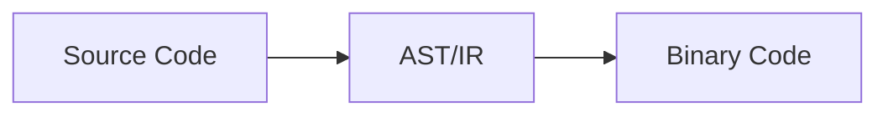
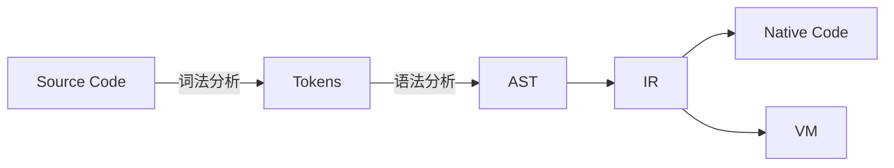
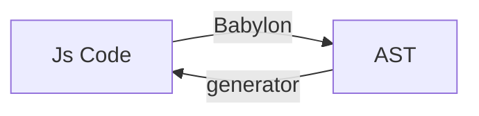
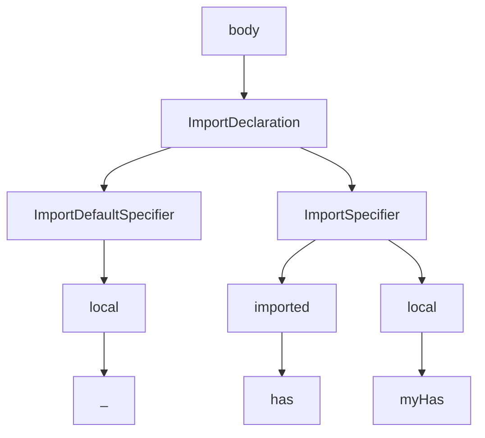
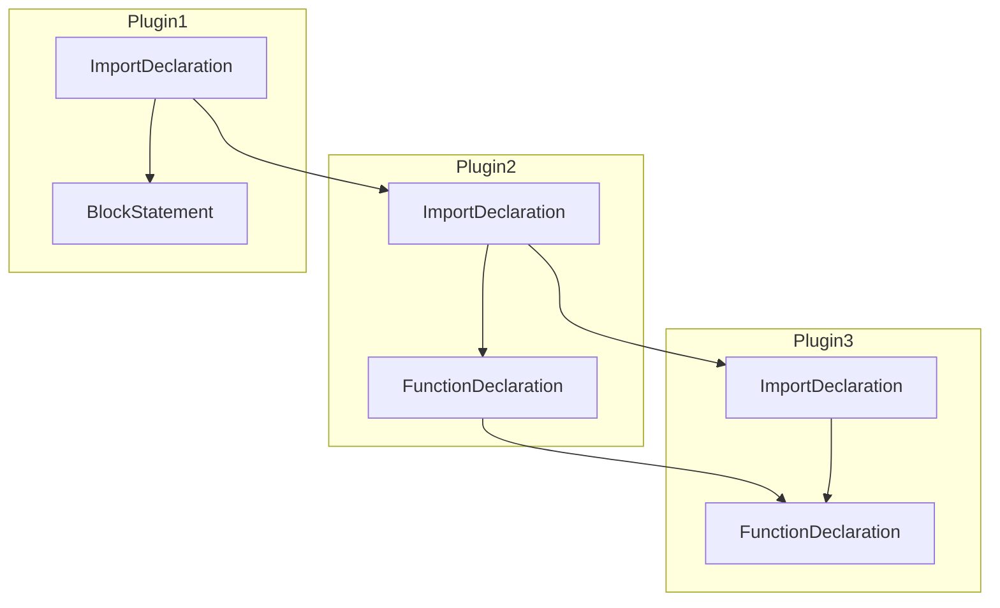

# babel-plugin-my-import

> write by Hydrogen, 2018.6

## 介绍

实现组件库/工具库的按需加载，类似 `babel-plugin-transform-imports` 和 `babel-plugin-import`

我不会发布这个插件到 `npm`，实际生产请使用上述两个插件之一


## 使用

### 独立使用

```js
const babel = require("@babel/core")

const trans = babel.transformFileSync('yourfile.jsx', {
  plugins:[
    [require("./index"), { "library": "@alipay/antd-cloud", "libPath": "lib" }]
  ]
})

console.log(trans.code)
```

### 在 `.babelrc` (babel 7) 中使用：

1. 把该插件放在 `node_modules` 下

2. 配置 `.babelrc`

```js
{
  "presets": [
    "@babel/react" // I assume you are using react
  ],
  "plugins": [
    ["my-import", { "library": "@material-ui/core", "libPath" : "" }]
  ]
}
```


# 如何用写一个 Babel 插件

> 自己之前做的一次分享，流程图使用 mermaid


## 一、编译原理基础


### 1. 前端与后端




### 2. 完整流程




## Babel

> Babel is a JavaScript compiler.

说 **compiler** 可能不合适，应该说是  **transpiler**




```
acorn —> Babylon —> @babel/parser(babel 7)
```


Babel 6 完全插件化

- plugins
- presets


## 二、写一个 Babel 插件做 antd-cloud 的按需加载


### 1. 原理

```js
import { AcpForm } from '@alipay/antd-cloud'

// -- after translate -->

import AcpForm from '@alipay/antd-cloud/lib/Acpform'


/* -- babel-plugins-import 额外多做了
 *    1. 样式引入
 *    2. 删除未被下文使用到的引入
*/

```


### 2. ESM 

```js
import {has} from 'lodash'

import _ from 'lodash' // 实际等价于 import { default as _ } from 'lodash'

import * as _ from 'lodash'
```

ES Module 与 CommonJs Module 交互

```js
// a.js
module.exports = 42

// b.js (1)
import a from './a.js'

// b.js (2)
import * as a from './a.js'


// typescript 1.8
allowSyntheticDefaultImports

// typescript 2.7
esModuleInterop
```


Node >= 9 实验性功能

```
--experimental-modules
```


### 3. AST

> 在线查看生成的AST：http://astexplorer.net/

```js
// 例子：
import _, { has as myHas } from 'lodash'
```





### 4. 开始写插件

- visitor 模式

```js
module.exports = function ({ types: t }) {
  return {
    visitor: {
      ImportDeclaration: {   //   <-- 这是我们关心的AST节点
        enter(path, state) { //   <-- 这是我们访问这个节点的时机
		  //...
        },
        exit(path, state) {
          // ...
        }
      }
    }
  }
}
```

- @babel/types 提供了一些好用的工具函数

```js
// options passed by .babelrc or babel-loader
const { opts } = state

// path.node.source is the library/module name, like 'antd-cloud'.
// path.node.specifiers is an array of ImportSpecifier | ImportDefaultSpecifier | ImportNamespaceSpecifier.
const source = path.node.source
const specifiers = path.node.specifiers

if (opts.library !== source.value) {
  return
}

// transform all ImportSpecifier to importDefaultSpecifier
// example: import { has } from 'lodash' --> import has from 'lodash/has'
const newImportDecls = specifiers.map((specifier) => {
  return t.ImportDeclaration(
      [t.importDefaultSpecifier(specifier.local)],
      t.StringLiteral(
          pathLib.join(source.value, 
                        opts.libPath || '', 		    
                        specifier.imported.name)
          )
    )
})

path.replaceWithMultiple(newImportDecls)
```


### 5. 注意事项/坑


插件执行顺序



- plugins 先于 presets
- plugins 从上到下
- presets 从下到上


## 三、其他方法


### 1. Tree shirking

> 摇落树上那些死去的叶子


本质是得益于 ESM 的静态性

- Webpack 4

- **sideEffects** field in package.json

- UglifyJSPlugin 或者其他具有 DCE 功能的压缩工具


### 2. DCE

>  Dead Code Elimination

死代码消除，编译原理中一个常见的优化

从这个角度说，我们之前做的，不过是 DCE 的一部分而已


### 3. IDE 提示 / Lint 工具

- 工具帮我们做了很多检查，但说到底还是看开发人员自己


## 四、Babel 的未来

Babel 6 以来的变化方向：


1. 平台化
2. 模块化


> Babel不应该仅仅只是个ES6语法转换器，取而代之的，它应该成为一个平台，它应该包括一组精心设计的工具用于创建下一代JavaScript工具集


> Babel可以走的更远，
> Babel有能力驱动代码压缩、代码规范（Linter）、代码格式化、语法高亮、代码完成工具、 类型检查、codemod工具等一系列功能，
> Babel能够让JavaScript社区朝着更好的方向发展
